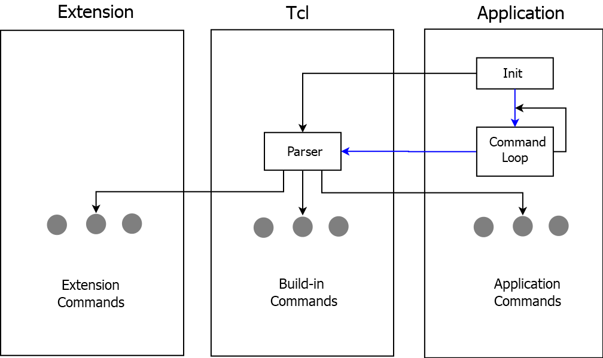

# IC 为何偏恋三十而立的Tcl

Tcl，发音做"tickle"，是Tool Command Language的首字母缩写。

有些编程语言本身单独看起来并没有优势，脱离开应用场景后甚至可以说是一门即将被淘汰的语言，这一篇我们来看看Tcl （我认为单独来看一点优势也没有）没有被淘汰的原因有哪些。

Tcl 依然做为IC 设计中的主力语言存在着，为什么IC 偏偏恋上了Tcl，今天我来就语言的特点谈谈我对这个话题的看法，用开放的心态看待Tcl，你可以搜索 “Tcl War”，不少程序语言发明人对Tcl 和其他程序都有一些有趣的论战。

这是我接下来要讲的重点部分：

* 第一部分细数了Tcl 的优点和不足，快而立之年的Tcl 为何依然在IC 中发光发亮。
* 第二部分有一个Tcl 的小测验，看看你可以得几分，了解你和Tcl 的亲密度。
* 第三部分我会介绍一些我的经验，我心目中好的IC Tcl 程序的特点以及几个实例展示。

## Tcl 的诞生历史

<!--若作为公众号发送，注意：
可能不包含这部分或者不作为主要内容
放于后面或者仅仅作为链接.
-->

Tcl/Tk 的发明人 John Ousterhout 教授在八十年代初，是伯克利大学的教授。在其教学过程中，他发现在集成电路 CAD 设计中，很多时间是花在编程建立测试环境上。并且，环境一旦发生了变化，就要重新修改代码以适应。这种费力而又低效的方法，迫使 Ousterhout 教授力图寻找一种新的编程语言，它即要有好的代码可重用性，又要简单易学，这样就促成了 Tcl (Tool Command Language) 语言的产生。

Ousterhout 教授被 SUN 于 1994 年召致麾下，加入 SUNLab，领导一个小组从事将 Tcl 移植到所有其它平台的工作，如 Windows 和 Macintosh。同时为 Tcl 增加了 Safe-Tcl 安全模块, 并为浏览器的开发了 Tcl plug-in，以及支持 Java bytecode 的编译器，大字符集，新的 IO 接口，与 Java 的计算平台相连等。Tcl还有自己的浏览器。在面向对象程序设计占主导地位的今天，又开发了支持面向对象的 incr Tcl。为了鼓励各厂商开发第三方的程序，Tcl 的源代码可免费下载。所有这些努力使 Tcl 成为一个适应当代信息产业潮流的，支持多平台的，优秀的的开发语言。

Ousterhout 教授于 1998 年初，离开了 SUN，自立 Scriptics 公司，继续 Tcl/Tk 的研究和开发工作。

Tcl 最初的构想的是希望把编程按照基于组件的方法 (component approach)，即与其为单个的应用程序编写成百上千行的程序代码，不如寻找一个种方法将程序分割成一个个小的, 具备一定“完整”功能的，可重复使用的组件。这些小的组件小到可以基本满足一些独立的应用程序的需求，其它部分可由这些小的组件功能基础上生成。不同的组件有不同的功能，用于不同的目的。并可为其它的应用程序所利用。

当然, 这种语言还要有良好的扩展性, 以便用户为其增添新的功能模块。最后，需要用一种强的，灵活的“胶水”把这些组件“粘”合在一起, 使各个组件之间可互相“通信”，协同工作。程序设计有如拼图游戏一样，这种设计思想与后来的 Java 不谋而合。**终于在 1988 年的春天, 这种强大灵活的胶水 - Tcl 语言被发明出来了。**

按照 Ousterhout 教授的定义， Tcl 是一种可嵌入的命令脚本化语言 (Command Script Language)。“可嵌入”是指把很多应用有效，无缝地集成在一起。“命令”是指每一条 Tcl 语句都可以理解成命令加参数的形式：

<!-- 源文件： <root>/res/src/tcl_structure.dia -->

从图中我们可以了解到有个概念很重要，你输入到Tcl的所有交互的指令或者其他接口都被认为是文本，按一定的顺序进行parser。

EDA软件对Tcl的支持现在都已经到8.6了，由于其扩展性好，调试简单，C接口友好，使用者学习成本低，这些都是商用软件的价值所在，最重要的是开源，免费。在IC设计流程中，有些文件格式是基于Tcl的，比如SDC。

<!-- Tcl 发展事件表 -->

|Date|Event|
|------|-----|
|January 1990|Tcl announced beyond Berkeley (Winter USENIX).|
|June 1990|Expect announced (Summer USENIX).|
|January 1991|First announcement of Tk (Winter USENIX).|
|June 1993|First Tcl/Tk conference (Berkeley). [table] geometry manager (forerunner of [grid]), [incr Tcl], TclDP and Groupkit, announced there.|
|August 1997|Tcl 8.0 introduced a bytecode compiler.|
|April 1999|Tcl 8.1 introduces full Unicode support and advanced regular expressions.|
|August 1999|Tcl 8.2 introduces Tcl Extension Architecture (TEA)|
|August 2000|Tcl Core Team formed, moving Tcl to a more community-oriented development model.|
|September 2002|Ninth Tcl/Tk conference (Vancouver). Announcement of starkit packaging system. Tcl 8.4.0 released.|
|December 2007|Tcl 8.5 added new datatypes, a new extension repository, bignums, lambdas.|
|December 2012|Tcl 8.6 added built-in dynamic object system, TclOO, and stackless evaluation.|

我们现在最新使用的也是Tcl8.6，最近一次发布时Jul 27, 2016。

## 三十而立的Tcl 为何依然发光发热

<!--表达作者的主要观点，本文的第一个重点.-->

* 免费

免费，尤其是对商业免费是重要的，企业对轮子的选择，如果不想自己造，那就要规避产品的法律风险，而免费开源（某些协议）是首先消除了企业的这一顾虑，而开源更是给了企业更大的自主权，可以利用整合的力量，下面一点我就会提到Tcl 的另外一个重要的特性。这一点对于我们个人工作中，生活中对工具、学习材料的选择，感性除外，就理性而言，需要考虑风险，成本与产出，任何人的时间和关系都是成本。

* C 的结合精密

Tcl 是用C 语言开发的。它现在可运行在Unix，Windows 和Macintosh 等各种平台上。与C/C++ 的精密结合，互相调用方便进行切入。高可用的商业软件使用C++开发的很多，而选择一种脚本语言可以做为高级语言的辅助工具也很重要。从Tcl 中访问C 语言可以在外部为程序临时打补丁；相反，从C 语言中方位Tcl 可以将输入内容传递给内部功能。你中有我，我中有你的配合虽然在最终用户处使用场景不多，对于IC 这个处理的设计异常复杂多变的对象来说，提供了类似于在线调试的能力，编译语言的可靠性和脚本语言的灵活性。

* 开发部署周期短

脚本语言是解释性语言，不需要编译，这个是脚本语言通用的特性，这个特性保证了支持团队的反应时间，如果工程师在设计中遇到一个问题，发给支持团队，可能是EDA 公司，可能是公司内部的CAD 部门，他们需要重写编写一些功能，对代码进行编译，测试，然后再发布到出问题的工程师手里，如果还是不能解决问题，则需要继续迭代，这个沟通过程当然有点典型和夸大的成分，非常没有效率，如果使用脚本语言，不触及最核心的高级语言功能代码，只是对外部的东西进行处理，提供一个接口与内部进行沟通，脚本的测试和调试也要快非常多。总结来说就是开发和部署的周期大大缩短，适合IC 行业，IC 行业中的核心功能不需要快速迭代，AE 或者CAD 工程师面对的是如何将客户的数据或者输入格式调整到工具能够识别的最佳状态，找到一个最好的输出Pattern 和Result。

* TK 图形界面

Tk (Tool Kit) 是基于 Tcl 的图形程序开发工具箱, 是 Tcl 的重要扩展部分。Tk 隐含许多 C/C++ 程序员需要了解的程序设计细节, 可快速地开发基于图形界面 Windows 的程序。据称, 用 Tcl/Tk 开发一个简单的 GUI 应用程序只需几个小时, 比用 C/C++ 要提高效率十倍。需要指明的是这里所说的“窗口”是指 Tcl 定义的窗口，与 X-Windows 与 MS Windows 的定义有所不同，但它可完美地运行在以上两个系统上。

TK 做为各种脚本语言都支持的一种图形界面，它的Component binding 等思想到现在都是很好的方法。图形界面是和用户进行交流的一个重要工具，TK 最为一个快速的模型，可以很简陋也可以很优雅。在最后一个部分，我将会介绍几个TK 的著名程序，除了使用它们，阅读它们的源代码也是受益匪浅的。

* 调试性语言
* 整合性语言
* 入门简单，转移关注度
* 扩展性强（package 的优势）

跨平台
网络功能

## IC 工程师为什么要熟悉Tcl 以及其他编程语言

* Lisp
  * Sheme
  * SKILL
* Perl
* Python
* Shell

从JD 谈起，如何自查tcl 水平和提高Tcl 编程能力。
本文的第二个重点。
开发若干问题，由浅入深提到Tcl 的概念做为测试的级别划分。

## Tcl 家族：Tcl/Tk/Expect

普及Tk 和Expect，本文的第三个重点，既然放在最后，关注度没有前两个高。

## 好的Tcl 程序的标准

为xhub 的结构铺路

## Tcl 优势的几个实例鉴赏

几个Tk 程序的例子

## 参考内容

* http://www.wikiwand.com/en/Scripting_language
* https://blog.csdn.net/larryliuqing/article/details/20902181
* http://scc.qibebt.cas.cn/docs/linux/script/TclTkall.pdf
* 《Tcl & the Tk Toolkit》
* 《Tcl/Tk : a developer’s guide》
* 《Practical Programming in Tcl and Tk》