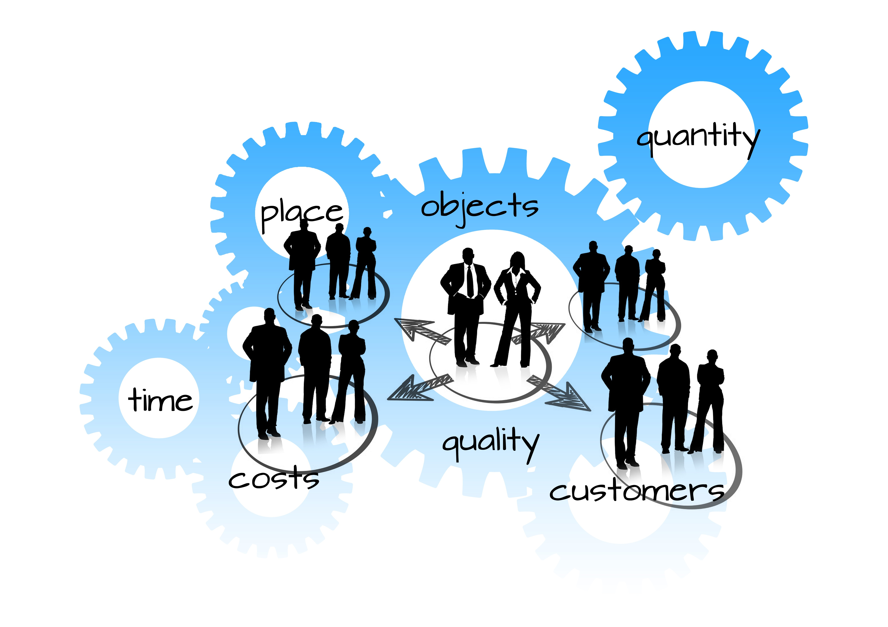
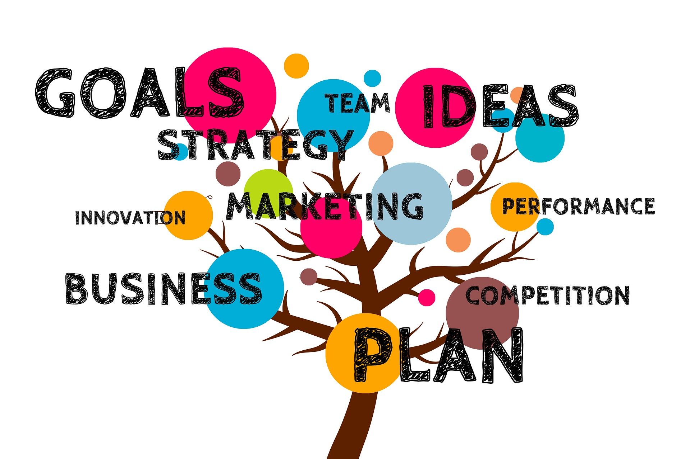

# “刷脚本” 的学术讨论

<!-- 原创认证 -->

本文经「原本」原创认证，访问[yuanben.io](http://yuanben.io/)查询[【5R9GIIKQ】](https://yuanben.io/article/5R9GIIKQVGY65I67QOX80FTKVVA0ZZX197Z0UFDJVDV69XVWIL)获取授权信息。

---

做为一个经历多年IC Tapeout 后转做的IC CAD 从业者，我想聊一聊“刷脚本”这件事，把它上升到理论的高度。

## “刷脚本” = “使用流程（Flow）”

    流程是指一个或一系列、连续有规律的行动，这些行动以确定的方式发生或执行，导致特定结果的实现。

    国际标准化组织ISO9000认证认为流程是一种将输入转化为输出的相互关联和相互作用的活动。

我比较赞同这段话的原因在于它诠释了几个关键的点，流程的作用是把事情做出来，IC 就是完成一个个SPEC 要求的内容：为功能，为生产完成 Closure 的目标。其次后半句揭示了我最赞同的部分，相互联系（Connection），单一的功能可以很强大，可以很深入，但是没有了联系，就不能产生流动，没有价值的传播和再造。

所以我的观点是，比如IC 实现方面，单一的Logic Synthesis 技术提升有没有意义呢？是有很大意义，但是能和具体功能结合，后端物理实现结合的技术能发挥的更多。

解读完我引用的一段话，说说“刷脚本” ，话分两类人，新手很少提及这个词，看上去没有技术含量，对于新手来说，需要的是究其（流程）内涵；而对于有经验的人来说，一个流程“刷”下去，胸有成竹，心里清楚整个过程和原理，那么工作慢慢就变成了“刷脚本”。

上次讲了Tcl，那么这次我把自己对流程相关的学习和体会，做个分享。

## 建立 IC Flow 的意义

流程更多的是一个管理方面的概念，对于IC 各大公司都有基于自己工具的Flow，而我通过阅读思考得到的是脱离了工具的普适的流程管理在IC 上的理解。当你觉得遇到瓶颈的时候，无论什么方面，这个时候更应该去学习一些理论知识，并试着做些理论到工程的转换，当然如果能做为一种习惯更好。关于流程的意义这一部分，我觉得各个文章和书讲得都很好，我收藏的引文 1 ，它表述的观点，我觉得放到 IC 的流程管理上一点也没有什么违和感，我借用它作为小标题。

- 建立关系，呈现逻辑

这个是显而易见的，IC Flow 需要很强的逻辑性和前后依赖关系。很多时候工程师看到一个脚本都会去问为什么这么做，然后可以牵出一堆写该脚本的理论基础，有点基于工艺生产，有的基于经验，有的基于法务等等。

【体会】做为工程师如何看待Flow，Flow 是必须要用的（公司规定），保证了质量和效率（后面会提到该好处），有人说会弱化工程师的能力，是有一点这方面的问题，久而久之看上去你是个“刷脚本”的人，但从大的方面看，这个流程是基于通用的IC 工程实现做起来的，从定SPEC 到写算法，到仿真和实现以及各类检查。我以前觉得没办法有一个IC 全局观，其实从Flow 里去学习总结，很容易获得IC 全局观。

Flow 建立了关系，呈现了逻辑，我每次使用，都着重理清关系，读懂逻辑，这个更多的我叫他软技能；对单点技术，比如CTS 怎么做，这是一个精致知识点的工作，是个人硬技能的体现。对IC 硬技能培养专家，软技能培养管理（技术管理我也归为此类）。

- 细分工作，明确职责

流程的切分带来了流水线，将IC 这个复杂的过程分为若干步，随着规模的越来越大，这个也是大势所趋。从我熟悉的IC 实现上，小的设计一个人可以做整个IC 实现，没有太多知识和Schedule 上的压力，而大的设计，可以分得很细，综合一拨人，Floorplan 一拨人，写约束一拨人，CTS 一拨人，解Route Congestion 一拨人，做Timing 一拨人，物理验证一拨人，和Foundary 打交道的一拨人...

上面说了流程除了告诉你怎么做，也会有对输入和输出的规定，就是互相的Connection，这个过程如果定义地很清楚，那么细分工作下的权责分明，质量保证都蕴含在Flow 里了，消除扯皮。

【体会】从自己这一步的流程出发，假定你的输入是完全有问题的，并且假定你需要给出一个完全没有问题的输出；做到上述程度后，去了解你的输入是怎么产生的，你的输出需要给怎样的流程用（在自己硬技能保证的前提下）。

- 精简工作，提高效率

对于一个芯片工程，无论是行内人还是外人，我觉得都会认同这是一个很复杂很复杂的“沙子的逆袭之路”。好的流程有更多的自动化，更多的质量保证检查，更多的管理理念来共同推动效率的提高。流程和流程管理工具本身就可以就看成是一个软件，简单来看软件是对数据的信息化，批量化处理。

【体会】实现流程化管理，可以把常规的、重复的、固定的职能固化，这样管理者将会有更多时间做其它事情。使用一个好的流程，先学会它，然后抛弃它（将流程纳入自己的知识体系），把更多的精力放在设计本身。

- 规范管理，精益生产

对于IC 实现，我们的Flow 不是简单的Synthesis + Floorplan + Place + CTS + Route + STA + Physical Verification。还包含数据的管理，数据的交付等。

【体会】精益生产，对于IC 我能看到的是很多经验知识被不断迭代到Flow 中去，Flow 成为了一个沉淀知识的容器，可以帮助、提醒IC 工程师，及时完成流程中的所有环节。说了这么多是不是有兴趣再去好好理解一下你用的Flow 呢？

## IC Flow Reengineering （IC 流程重建）

IC 流程我们可以看作是生产芯片的一个过程，加入了很多方法学，半导体知识，EDA 的使用，以及个人的经验，可以说不是一个简单的物件构造过程，可以说是一个标准化下的创造过程。

计算机技术的发展，人工智能的出现都在不断地影响着我们的流程构建，虽然重建流程成本是巨大的，但是IC 工艺越来越复杂，新的计算技术越来越成熟，让我们明白在传统 IC 制造基础上建立的流程需要不断适应新的变化。

Why-How-What 是一种思考方式，而我要表达的是你能看到什么，进而说明我们为什么要这么做以及怎么做。

### What

IC 流程重建根据新的技术，新的需求，对IC Flow 进行升级改造甚至是全盘重来。很多团队不会去做一次很大的重建，更多的是小规模的升级，但是有时候重建又是迫在眉睫的。

所以一个好的迁移方案：流程融合+渐进式替代，回事很多团队愿意去接受和尝试的，也是比较正确的一个做法。

### Why

为什么要重建？

- 适应新的技术
- 提高团队能力
- 提高输出质量

主要动力应该差不多就是这几个，流程的上一层就是流程管理框架，一个好的流程管理框架可以帮助你适应新的技术，沉淀知识经验，提高输出质量。

### How

研究自己的流程，选择合适的管理框架，在不影响现有Tapeout 的基础上，在框架内对流程进行单点的提升和替换。同时要预留旧系统的继续服役期和新系统的上线适应期。

## IC 流程管理中的点

从流程的定义来看，我们关注的是当前这个点的输入，当前点本身，和当前点的输出。对于IC 过程来说：

- IC 生产资料管理
    - 库，技术文件等
- IC 生成过程管理
    - 人员，流程等
- IC 生产成果管理
    - 交付等

## 参考资料

1. [http://articles.e-works.net.cn/bpm/article129044.htm](http://articles.e-works.net.cn/bpm/article129044.htm)
2. 《流程再造》
3. 《流程的永恒之道》

图片均来自网络免费可商用图库，仅做为配合主题的装饰。

## 给自家IC 极客群打个广告

本群由IC 行业的几位工程师发起，以公益，开源，分享为宗旨，致力于推广IC 极客文化，组织大家深入交流IC 设计领域知识，经验及方法学，打造IC 设计圈的思想国。群内交流的方式为，每周二，五定期推送固定主题的干货文章，发起相关主题的群内头脑风暴和技术分享。也欢迎群友或IC 极客玩家随机发起不固定主题的讨论。欢迎联系文末的微信号小主入群参与分享交流。
在未来一周内，我会在IC 极客群内陆续分享一些之前做过的IP 质量检查和IP 管理流程开发经验，同时预告下周五的主题“IC 设计中的数据管理，版本管理及配置管理”，如果你身边有对此类话题感兴趣的朋友，不妨邀请他入群一起参与讨论或围观。
另外，你们心心念念的DFT 专场也会在近期开场，如果您希望参与开讲或讨论老样子联系文末的微信号小主。

